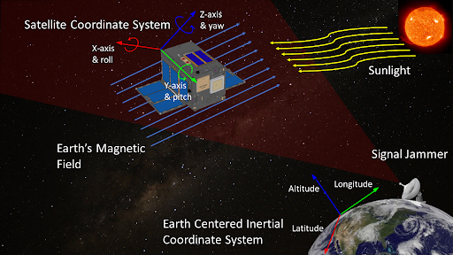

<h4 align="center">
    
</h4>

# Sensor Fusion for Autonomous Navigation

Create a low SWaP (Size, Weight, and Power) sensor suite to help an autonomous vehicle navigate when GNSS (Global Navigation Satellite System) signals are unavailable to the primary Position, Navigation, and Timing (PNT) system.

## Repository Contents

The repository includes the following:

- [`main.py`](main.py): File that outputs the orientation and position of the system to the command line and generates a data file.
- [`euler_plotting.py`](euler_plotting.py): Plots the data file using Euler's Angles.
- [`plotting.py`](plotting.py): Plots the data file using Axis and Angles.
- [`SensorFusion`](SensorFusion): Python sensor fusion algorithm code that calculates the estimated orientation and position of the system.
- [`GPS`](GPS): GPS measurement code.
- [`IMU`](IMU): IMU measurement code including calibration.
- [`Magnetometer`](Magnetometer): Magnetometer measurement code including calibration.
- [`Data`](Data): Output generated by the main.py code (data files).
- [`Docs`](Docs): Additional documentation and images for GitHub repository.
  
## Getting Started

The current implementation of this project was built in Python and CircuitPython and requires Python (>=3.9), matplotlib, numpy, adafruit-circuitpython-tca9548a, adafruit-circuitpython-gps, and adafruit-circuitpython-lsm6ds. In order to run [IMU/graphing_demo.py](IMU/graphing_demo.py), pyrr is required. In order to run [IMU/Gyroscope/gyroscope_calibration.py](IMU/Gyroscope/gyroscope_calibration.py), pynput is required. In order to run [Magnetometer/calibrate.py](Magnetometer/calibrate.py), scipy is required.

You can get the position and orientation of the system by running main.py. However, the orientation may not look correct on first glance of the command line. Therefore, using euler_plotting.py may be a better visualization.

>**NOTICE**: First run main.py to update the data for plotting. **PLOTTING IS NOT LIVE**

Magnetometer calibration may be needed if the testing environment changed. Please consult the [Magnetometer Section]() for more information on that process.

## Hardware Components

For more information on each hardware component, please see the following:

- [Raspberry Pi 4 Model B](https://www.raspberrypi.com/products/raspberry-pi-4-model-b/)
- [Adafruit Mini GPS PA1010D](https://www.adafruit.com/product/4415)
- [Adafruit TCA9548A I2C Multiplexer](https://www.adafruit.com/product/2717)
- [Adafruit Triple-axis Magnetometer - MMC5603](https://www.adafruit.com/product/5579)
- [Adafruit LSM6DSOX - Precision 9 DoF IMU](https://www.adafruit.com/product/4517)

## Authors

- Rishi Mantha - [@mantharishi](https://www.github.com/mantharishi)
- Adam Lahouar - [@adamlahouar](https://www.github.com/adamlahouar)
- Hayden Craun - [@Survivalman2020](https://www.github.com/Survivalman2020)
- Carl Nicklas - [@carlnick](https://www.github.com/carlnick)
- Mert Kaner - [@mertkaner](https://www.github.com/mertkaner)
- Marlin Spears - [@mlspears1228](https://www.github.com/mlspears1228)

## Special Thanks

The team would like to extend a special thanks to Dr. John Janeski, Richard Gibbons, and Professor Toby Meadows, for their invaluable advice and support throughout the duration of this project.
